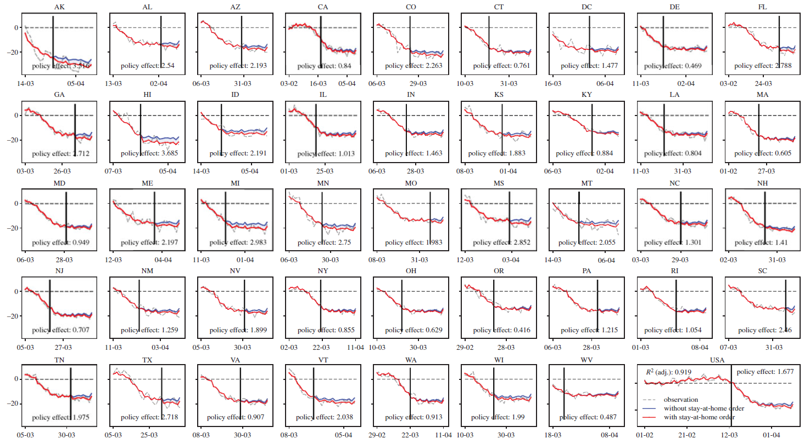

# Mobile device location data reveal human mobility response to state-level stay-at-home orders during the COVID-19 pandemic in the USA

#### Chenfeng Xiong, Songhua Hu, Mofeng Yang, Hannah Younes, Weiyu Luo, Sepehr Ghader and Lei Zhang

This study uses an integrated dataset, consisting of anonymized and privacy-protected location data from over 150 
million monthly active samples in the USA, COVID-19 case data and census population information, to uncover mobility changes during
COVID-19 and under the stay-at-home state orders in the USA. The study successfully quantifies human mobility responses with three important
metrics: daily average number of trips per person; daily average personmiles travelled; and daily percentage of residents staying at home. The
data analytics reveal a spontaneous mobility reduction that occurred regardless of government actions and a ‘floor’ phenomenon, where human
mobility reached a lower bound and stopped decreasing soon after each state announced the stay-at-home order. A set of longitudinal models is
then developed and confirms that the states’ stay-at-home policies have only led to about a 5% reduction in average daily human mobility.

## Code structure
* Data used for model building is located at the folder `data`, which is computed via `State_Features.py`.
* Three R scripts are used to fit the GAM models. Our model predicts the daily average number of trips and
daily average PMT across all states.
* `Plot_Fig56.py` is used to model results plot.

## Results
#### Estimated daily person-miles travelled increase/reduction at the national level and for each state

## Result calculation and rerun protocol

Run R scripts from the repository root. Shared `model_protocol.R` uses the included data by default; set `RSIF_DATA_PATH`/`RSIF_OUTPUT_DIR` to override. All states are included by default. An optional `RSIF_EXCLUSIONS` CSV must specify STNAME and a reason; required-model complete-case/nonfinite exclusions are recorded per row in population-coverage CSVs. Missing observations are never blanket-filled with zero.

`Final_GAM2.R` alone writes the main prediction CSVs, with adjusted R2/EDF/residual DF and provenance from the same full GAM fit. `Plot_Fig56.py` requires those statistics and does not rewrite observations or retain only effects of one sign. Effects average all policy days. The grid accommodates all included states.

Bootstrap draws resample complete state blocks (seed 0), preserve term names and draw IDs, log failed fits, and export 95% percentile intervals of within-draw coefficient contrasts; fewer than 90% successful pairs produces NA with a status. Bootstrap output never overwrites main-fit prediction files. Regenerate model and bootstrap outputs and plots. State_Features.py also fixes adjacent-state accumulation and consistent Approval units; regenerating those derived inputs requires the original source data. Existing public data and figures were not silently rewritten.
