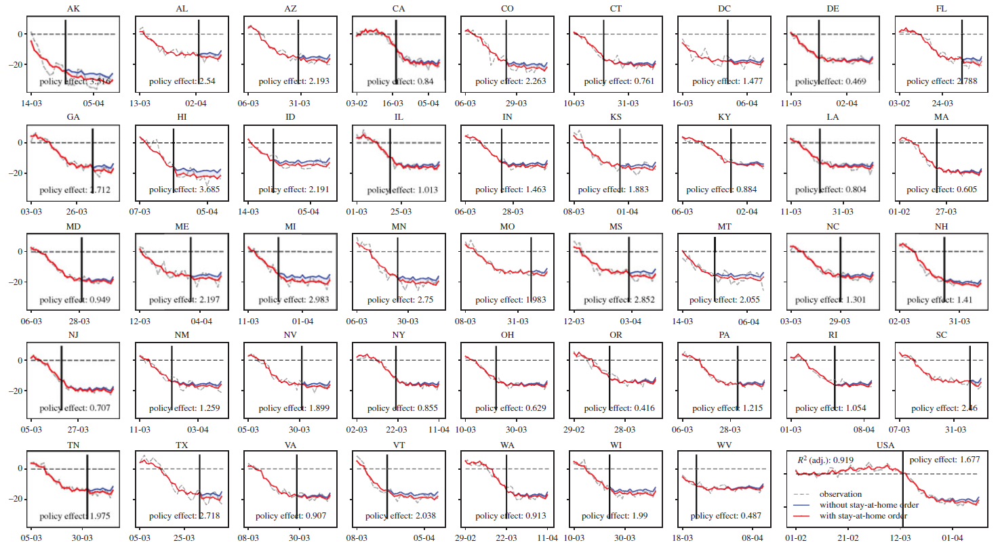

# Mobile device location data reveal human mobility response to state-level stay-at-home orders during the COVID-19 pandemic in the USA

This study uses an integrated dataset, consisting of anonymized and privacy-protected location data from over 150 
million monthly active samples in the USA, COVID-19 case data and census population information, to uncover mobility changes during
COVID-19 and under the stay-at-home state orders in the USA. The study successfully quantifies human mobility responses with three important
metrics: daily average number of trips per person; daily average personmiles travelled; and daily percentage of residents staying at home. The
data analytics reveal a spontaneous mobility reduction that occurred regardless of government actions and a ‘floor’ phenomenon, where human
mobility reached a lower bound and stopped decreasing soon after each state announced the stay-at-home order. A set of longitudinal models is
then developed and confirms that the states’ stay-at-home policies have only led to about a 5% reduction in average daily human mobility.

## Code structure
* Data used for model building is located at the folder `data`, which is computed via `State_Features.py`.
* Three R scripts are used to fit the GAM models. Our model predicts the daily average number of trips and
daily average PMT across all states.
* `Plot_Fig56.py` is used to model results plot.

## Results
#### Estimated daily person-miles travelled increase/reduction at the national level and for each state

